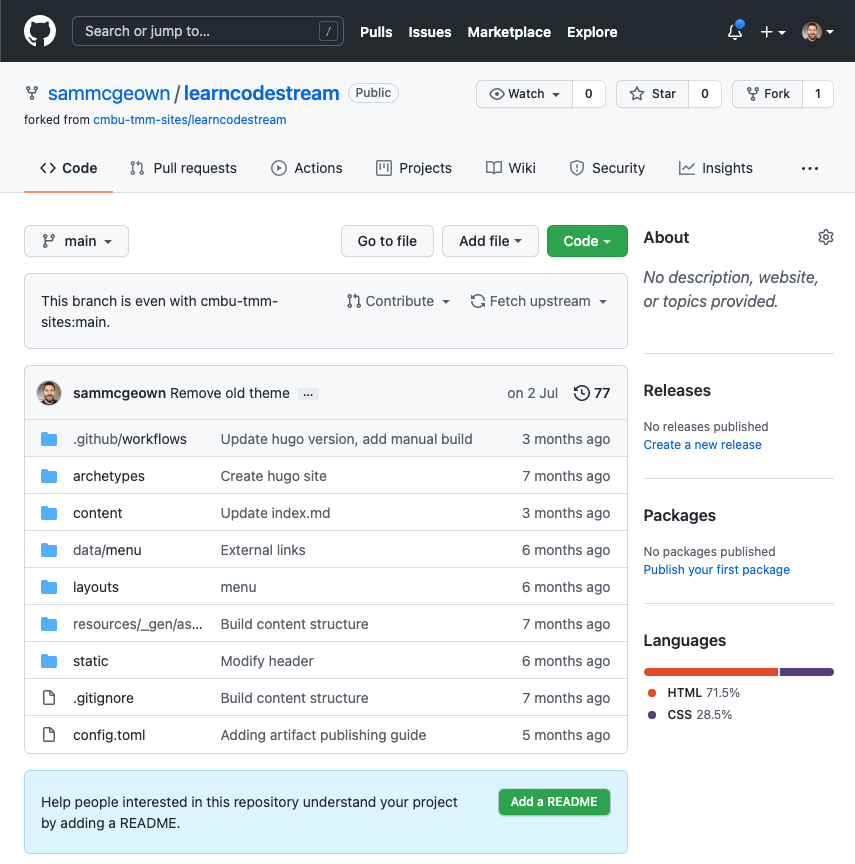
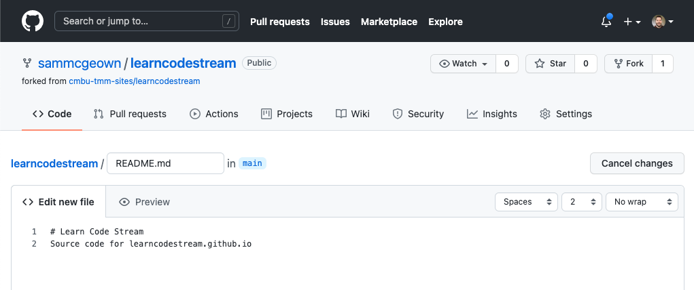
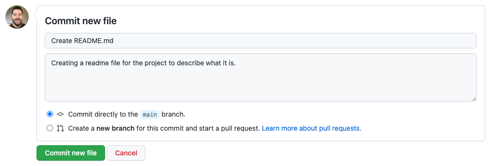
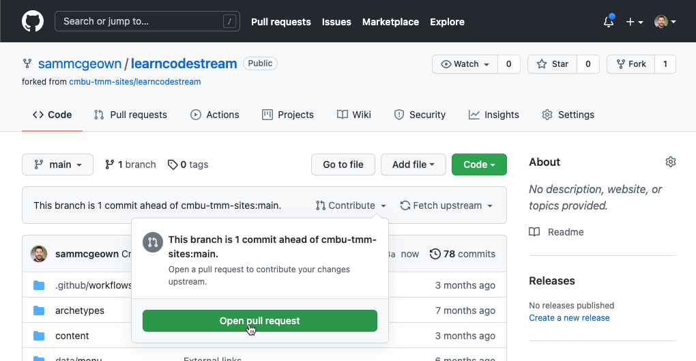

# Welcome to the Learn Idem Contributing Guide

Thank you for your interest in contributing to Learn Idem. In this guide you will learn how to contribute to the project.

This site is generated using [Hugo](https://gohugo.io/) and is hosted on GitHub Pages. The content and structure for the site is within the `content` directory. Examples of formatting and shortcodes available in the template can be found in the existing pages.

# Create a new issue
The first way to request changes to the project is to create an issue. If you spot a problem with the docs, search if an issue already exists. If a related issue doesn't exist, you can open a new issue using the [GitHub issue tracker](https://github.com/cmbu-tmm-sites/learnidem/issues).

# Make changes to the docs
The second way to make changes to the docs is to make a pull request. The pull request will be reviewed by the maintainers of the project and merged into the master branch.

The process for creating the Pull Request is as follows:
1. Fork the repository
2. Make changes to the docs
3. Commit changes
4. Push changes to the repository
5. Open a pull request

## Fork the repository
You can fork the repository to create a personal copy of the repository using the [GitHub fork feature](https://docs.github.com/en/get-started/quickstart/fork-a-repo).

## Make changes to the docs
Make changes to the docs and commit them to the repository. You can do this locally on your own computer, or using the [GitHub UI](https://docs.github.com/en/repositories/working-with-files/managing-files/editing-files).

## Commit changes
Any changes you make to the docs must be committed to your fork of the repository. You can [commit the changes using the GitHub UI](https://docs.github.com/en/repositories/working-with-files/managing-files/adding-a-file-to-a-repository) or by using local commands or a Git client.

## Push changes to the repository

If you're working in a local environment, you need to push the changes to the remote repository.

## Open a pull request

Your branch should now be ahead of the master branch. You can [open a pull request using the GitHub UI](https://docs.github.com/en/github/collaborating-with-pull-requests/proposing-changes-to-your-work-with-pull-requests/creating-a-pull-request-from-a-fork).

Once you've created your Pull Request, the maintainers of the project will review it and merge it into the master branch. They may ask you to make changes to the docs before merging, or may make changes to the docs and merge them into the master branch.